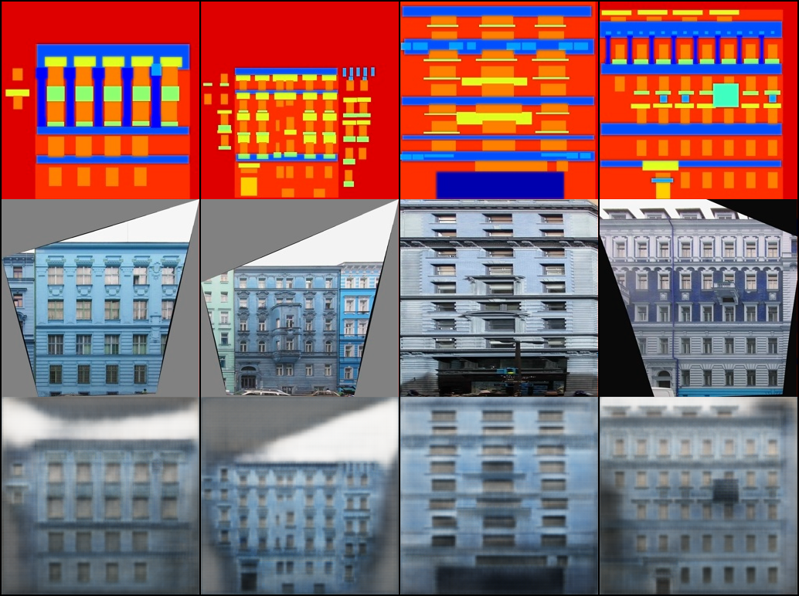

# Pix2Pix Pytorch Lightning implementation

This is an unofficial implementation using Pytorch Lightining. The code has been tested with Ubuntu 20.04, python 3.8.10, cuda 11.8 and pytorch lightning 2.0.1. To start using the repository:

## Installation

### Using docker
You can use docker to train and test the algorithm. For that you will need to have docker and nvidia container toolkit intalled. If you do not have them install, follow [this tutorial](https://docs.docker.com/engine/install/ubuntu/) to install docker and this [other one](https://docs.nvidia.com/datacenter/cloud-native/container-toolkit/latest/install-guide.html) to add gpu support.

If you are going to use docker to train and test the algorithm, then go straight away to the train and test section.

### Without docker
To install all the requirements, it is recommended to create a virtual environment. In my case I commonly use pyenv and virtual env for that. In case you want to install it, here is a [good tutorial](https://realpython.com/intro-to-pyenv/) on how to do so.

After that, you just have to run:

```bash
pip install -r docker/requirements.txt
````

```bash
git clone https://github.com/j-saez/pix2pix.git
<it is recommended to create a virtual environment and activate it>
pip install -r docker/requirements.txt
```

Then, go to `<pix2pix repo>/train_configs` and create you our configuration file in case you need to. Here is the default one:

```bash
from utils.configuration import Hyperparams, Dataparams, Generalparams, Configuration
configuration = Configuration(
        Hyperparams(
            epochs=1000,
            lr=2e-4,
            batch_size=1,

            adam_beta_1=0.5,
            adam_beta_2=0.999,
            weights_decay=0.0,

            gen_loss_weight=1.0,
            disc_loss_weight=1.0,
            l1_lambda=10.0,

            pretrained_weights=None, # None or path to pretrained_weights
            gen_input_size=256,      # Generator prepared for 256 input and output as in the paper
        ),

        Dataparams(
            dataset_name='facades', # facades, maps, edges2shoes edges2handbas, cityscapes, night2day
            prepare_data_per_node=True, # Download dataset if it is not available
            direction='b_to_a', # a_to_b or b_to_a (src dom to tgt or viceversa)
        ),

        Generalparams(
            num_workers=8,
            accelerator='cuda', # cuda, cpu
            devices=[0,], # if cuda: comma separated list with the devices to be used. if cpu: number of cores to use
            test_model_epoch=10,
        ),
        verbose=True)
```

## Training

In order to train the model go to the **root directory** of the repository and run:

```bash
sh docker/train_with_docker.sh --config-file <the name of the config file with no path># if you are using docker
python train.py --config-file <the name of the config file with no path> # if you are not
```

This will train the model with the default parameters for the experiments. In case you want to train the algorithm with different parameters you will either have to modify the train_configs/mnistm_experiments.py file or create a new one. If you do create a new one, you will have to **create inside the train_configs directory**. Then you can run:

If you have doubts about it, please read the configuration files section at the end of this document.

## Results

This are the results obtained after training the model on the facades dataset with the default options on the facades dataset:


<figure style="text-align:center;">
    
    <figcaption style="font-size: smaller;">Results on facades using the default config.</figcaption>
</figure>
